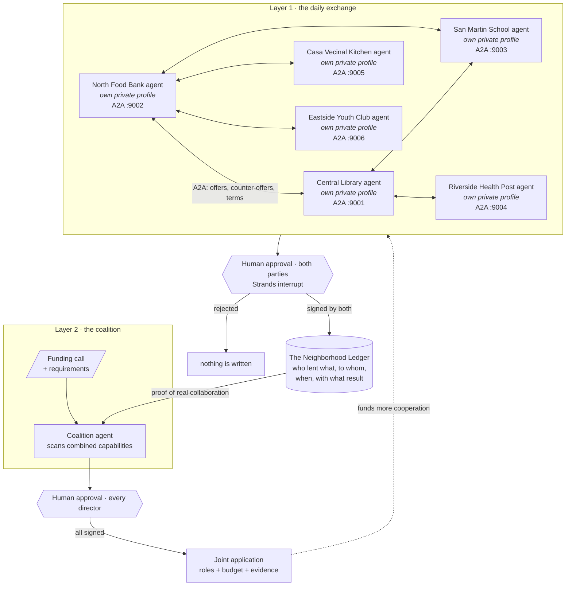

# Barnraise architecture

## The idea in one diagram

Every organization runs its own agent over its own private data. Agents talk to
each other across organizational boundaries using the A2A protocol. Six
organizations run as six processes on ports 9001 to 9006; whichever one starts a
round acts as the client for it, and the rest answer from their own servers. Nothing is
committed without human approval, and every approved agreement is written to a
shared ledger that later becomes grant evidence.



## Why the layers reinforce each other

Daily cooperation produces trust and evidence. The evidence makes a coalition
credible. The coalition brings money that funds more cooperation. The two layers
are one cycle, not two features.

| Layer | What the agent does | Who decides |
|---|---|---|
| Daily exchange | Discovers complementarity between neighbors, negotiates terms | Both organizations sign |
| Coalition | Cross-references a funding call against combined capabilities | Every director signs |

## Data isolation

An organization's data never crosses the wire as a data structure. Tools are
built as closures over one `OrgProfile`, so an agent has no tool that returns
another organization's resources or needs, and the organizations an agent talks to run in
their own processes, reached over the network. What crosses the A2A boundary is only
the message the agent chose to write.

```python
def build_resource_tools(profile: OrgProfile) -> list:
    @tool
    def list_idle_resources() -> str:
        # closes over this profile only
        ...
```

## Human approval is structural

`record_agreement` is the only irreversible act an org agent can perform, so it
is the one tool gated by `HumanInTheLoop`. Read-only tools run freely. The agent
stops with `stop_reason == "interrupt"` and the caller resumes with the
director's decision. In the web app the round runs in a worker thread that
blocks on an `Event` until a human answers, so the pause is real and visible.

An agreement reaches `aprobado` only when both organizations have signed. A
coalition reaches `aprobada` only when every member has. A single signature is
never enough.

The approval of a pause *is* that organization's signature, so it is recorded
against the agreement that approval just wrote. Recording it later, at the end of
the round, tied the signature to whatever the last decision happened to be, which
left an approved agreement unsigned while the interface said otherwise.

A director can only decide their own organization's pause, and the server rejects
a signature that arrives under a different organization or from an organization
that is not a party to the agreement.

What this does NOT do is authenticate anyone. There is no session and no token:
the signing organization is a field in the request, so the checks stop the
interface from doing the wrong thing and would not stop a determined caller with
an HTTP client. The ledger's two-signature state machine is sound; establishing
who is speaking to it is the piece a real deployment still needs.

## Deterministic guards around the model

An agreement in the ledger is evidence a funder will read, so structured data
comes from tool arguments and never from prose, and every field is checked
before it is written:

| Guard | Rejects |
|---|---|
| Placeholder check | Empty fields, `N/A`, `TBD`, and anything under four characters |
| Counterparty check | An org id that is not a known organization, or ourselves |
| Coherence check | A received resource sharing no substantive word with the need or the neighbor's offer |
| Direction check | Giving away a resource the organization does not own |
| Calendar check | A weekday nobody negotiated |
| Coalition roles | Crediting an organization with a requirement it does not cover |
| Coalition budget | A split that does not add up to the grant amount |

Comparisons ignore calendar words, because a day or a time of day says when a
resource is free and never what it is. Without that, "Saturday mornings" once
overlapped "Tuesday mornings" and let a school hand over a van it does not own.

Which need a round set out to cover is decided in discovery, by code, so the
ledger records that need rather than the model's restatement of it.

What the guards do not decide is whether a resource genuinely covers a need.
That is a judgement, and it belongs to the director who signs: the decision panel
puts the need and the resource side by side for exactly that reason. A round
whose negotiation drifts to a different need closes with a human declining it,
not with a check catching it.

Eligibility is computed in plain code rather than by the model, and the profile
list is deduplicated before anything is summed, because the same organization
named twice used to double the population it serves against a population
threshold.

## Components

| Path | Role |
|---|---|
| `agents/org_agent.py` | The organization agent and its mandate |
| `agents/tools/` | Resources, needs, proposal evaluation, A2A messaging, grants |
| `agents/approval.py` | Ledger tools behind the human approval gate |
| `agents/coalition_agent.py` | Coalition detection and proposal |
| `a2a/serve_org.py` | Exposes one organization as an A2A server |
| `a2a/round.py` | CLI: discovery, negotiation, approved ledger entry |
| `a2a/coalition_round.py` | CLI: funding call scan and joint application |
| `ledger/` | Schema, persistence, and collaboration evidence |
| `web/` | FastAPI app, event bus, live UI |

## Round flow

Three phases, three agents with narrow jobs. A single agent asked to negotiate
and file at once loses track of the terms.

1. **Discovery** (deterministic): ask every neighbor over A2A what is idle, then
   keyword-match the answers against our needs and pick the most urgent hit.
2. **Negotiation** (LLM over A2A): an agent with only `contact_neighbor` closes
   concrete terms with the chosen neighbor.
3. **Registration** (LLM tool call + human): a separate agent with only the
   ledger tools files the agreement. The guards above run here.

## Model providers

Strands is model-agnostic, and the whole neighborhood switches provider with one
environment variable. Nothing else in the code changes:

```bash
BARNRAISE_MODEL_PROVIDER=bedrock   # Amazon Bedrock
BARNRAISE_MODEL_PROVIDER=gemini    # Google AI Studio, free tier
BARNRAISE_MODEL_PROVIDER=ollama    # local, no key, no cost
```

The agents' behaviour does not depend on the provider: the deterministic guards
around the ledger are what keep a weaker model from writing a bad agreement.
